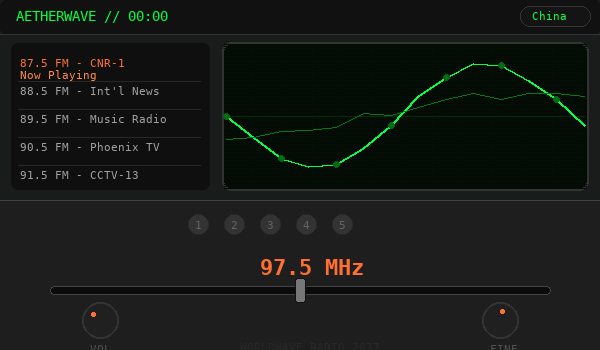
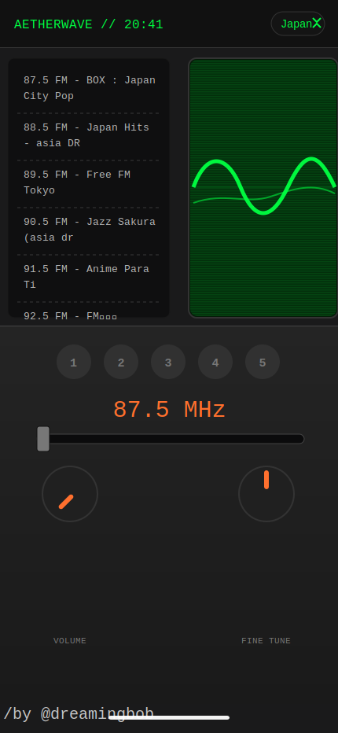

## Worldwave Radio 2077

<p align="center">
  <strong>A cinematic cyberpunk web radio experience for exploring live stations around the world.</strong>
</p>

<p align="center">
  Tune into global radio stations through a retro-futuristic interface inspired by analog machines, CRT displays, signal noise, and late-night transmission culture.
</p>

<p align="center">
  <a href="./README.zh-CN.md">中文说明</a>
  ·
  <a href="./index.html">Source HTML</a>
  ·
  <a href="https://dreaminmaster.github.io/Worldwave-Radio-2077/">Live Demo</a>
</p>

<p align="center">
  
</p>

<p align="center">
  
</p>

---

### Live Demo

GitHub Pages demo:

**https://dreaminmaster.github.io/Worldwave-Radio-2077/**

---

### About

**Worldwave Radio 2077** is not just a radio player.

It is a small atmospheric web interface for tuning into distant live signals from different countries, wrapped in a cyberpunk-inspired console experience. The project combines global online radio streams with a fictional hardware-like control panel, including a power-on screen, country selector, station list, tuning slider, preset buttons, mechanical click sounds, signal noise, and a CRT-style oscilloscope visualizer.

The goal is to make listening feel like operating an old machine from a future that never happened.

---

### Features

- Global live radio station discovery
- Cyberpunk-inspired radio console interface
- Country-based station switching
- Tuning slider with simulated frequency feedback
- Preset station buttons
- Web Audio API sound effects
- Static noise simulation
- Oscilloscope-style audio visualizer
- CRT scanline overlay
- Mobile-friendly single-page layout
- PWA-ready manifest structure

---

### Project Concept

Most radio websites are built as clean lists.

Worldwave Radio 2077 takes a different direction. It treats radio as an experience: power on the machine, scan through distant signals, hear static, choose a station, and watch the waveform move.

This project is designed as a portfolio piece, interface experiment, and non-commercial demonstration of visual interaction design.

---

### Tech Stack

- HTML
- CSS
- Vanilla JavaScript
- Web Audio API
- Canvas API
- Radio Browser public radio directory

No frontend framework is required.

---

### How to Run

Clone the repository:

```bash
git clone https://github.com/Dreaminmaster/Worldwave-Radio-2077.git
cd Worldwave-Radio-2077
```

Open `index.html` directly in a browser.

For a better experience, run it through a local server:

```bash
python3 -m http.server 8080
```

Then open:

```text
http://localhost:8080
```

---

### Notes

Some radio streams may fail to play because of stream availability, regional restrictions, HTTPS rules, or cross-origin limitations. This is normal for public internet radio sources and does not necessarily indicate a problem with the interface itself.

The source page is kept as the original prototype. This repository packaging focuses on presentation, preview, and non-commercial project documentation.

---

### Usage Restriction

This project is for **personal viewing, learning reference, portfolio display, and non-commercial demonstration only**.

Commercial use, resale, paid redistribution, use inside monetized products, or use as part of a client project is not permitted without written permission from Dreaminmaster.

See [LICENSE](./LICENSE) for details.

---

### Author

Created by **Dreaminmaster**.

Copyright © 2026 Dreaminmaster. All rights reserved.
